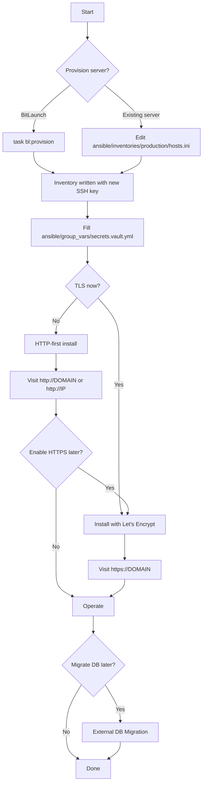
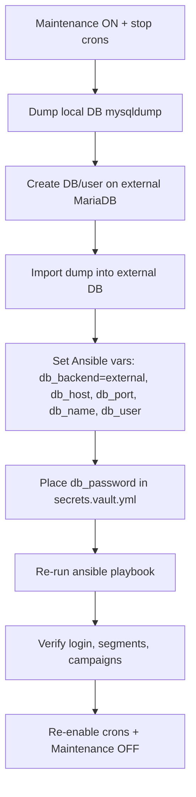

# MKT-SRV Vanilla Mautic – Provisioning & Migration Flow

This guide shows end-to-end paths to provision vanilla Mautic on a single host, enable HTTPS now or later, and optionally migrate to an external MariaDB.

## High-level flow



## Commands by step

- BitLaunch server (optional)

```bash
# Requires: BITLAUNCH_API_KEY in your env or .env
task bl:provision
# Inventory written to ansible/inventories/production/hosts.ini
```

- Existing server

```ini
# ansible/inventories/production/hosts.ini
[web]
mkt-srv-1 ansible_host=YOUR_IP ansible_user=ubuntu
```

- Populate secrets (one-time)

```yaml
# ansible/group_vars/secrets.vault.yml
mautic:
  admin_password: 'STRONG_ADMIN_PASS'
  db:
    password: 'STRONG_DB_PASS'
  db_root_password: 'STRONG_ROOT_PASS'
# Tip: ansible-vault encrypt ansible/group_vars/secrets.vault.yml
```

- HTTP-first (fast start)

```bash
ansible-playbook -i ansible/inventories/production/hosts.ini ansible/playbooks/site.yml \
  --vault-password-file .vaultpass \
  -e enable_letsencrypt=false -e db_backend=local
```

- Enable HTTPS now or later

```bash
ansible-playbook -i ansible/inventories/production/hosts.ini ansible/playbooks/site.yml \
  --vault-password-file .vaultpass \
  -e enable_letsencrypt=true -e domain="YOUR_DOMAIN" -e letsencrypt_email="YOU@example.com"
```

- Visit Mautic
- HTTP-first: http://DOMAIN or http://IP
- HTTPS: https://DOMAIN

## External DB migration (optional later)



- Dump current DB

```bash
mysqldump -u root -p --single-transaction --routines --triggers mautic > mautic.sql
```

- Re-provision pointing to external DB

```bash
ansible-playbook -i ansible/inventories/production/hosts.ini ansible/playbooks/site.yml \
  --vault-password-file .vaultpass \
  -e db_backend=external -e db_host="DB_HOST" -e db_port=3306 -e db_name="mautic" -e db_user="mautic"
```

## Health and logs

- Quick ping

```bash
task ping
```

- Nginx/PHP-FPM status (on server)

```bash
systemctl status nginx
systemctl status php8.2-fpm # adjust for your php_version
```

- Ansible logs
- Written to `logs/ansible/ansible.log` (configured in ansible/ansible.cfg)

## Notes

- You can enable HTTPS at first install or later; the playbook is idempotent.
- SSH keys for BitLaunch provisions are generated per run in `./tmp_ssh_keys/` and written into inventory.
- Store secrets in Ansible Vault for safety (use `.vaultpass`).
